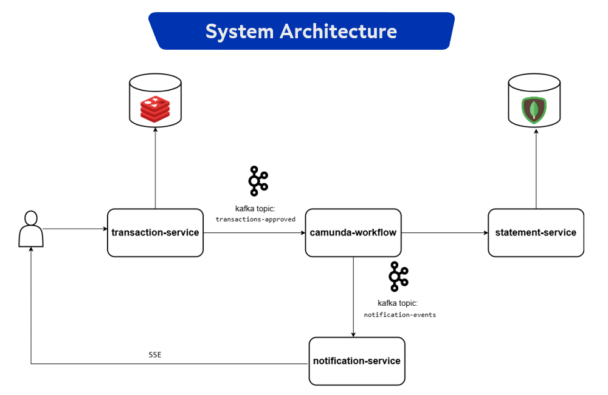
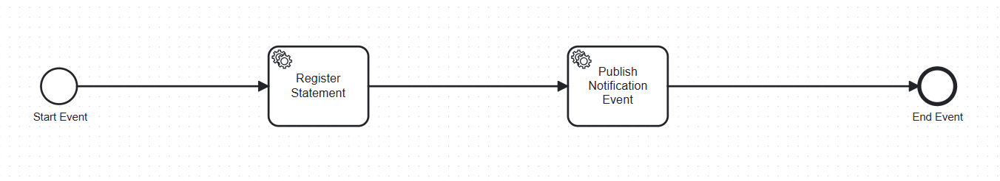
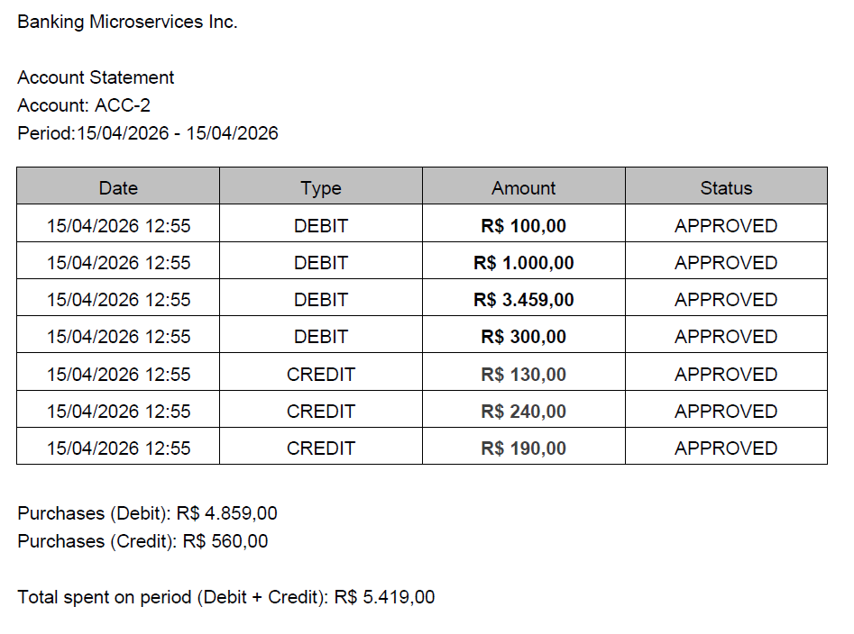
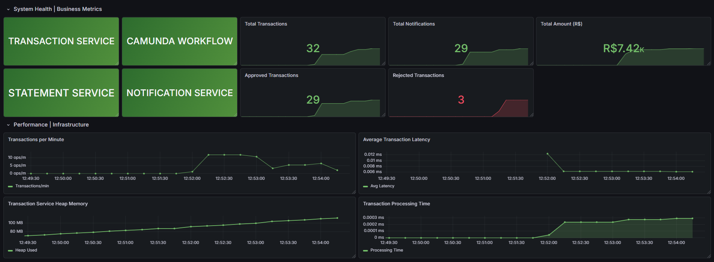

# Banking Microservices

A microservices-based banking simulation built with **Java 21, Spring Boot, Kafka and Camunda BPMN**.

The system processes debit and credit transactions, generates account statements, sends real-time notifications, and exposes operational metrics for monitoring and observability.

This project was developed as the final assignment of an **Advanced Java course at Agibank**.

---

# Architecture

The system follows an **event-driven microservices architecture**.

  

### Flow overview

1. A client sends a transaction request to **transaction-service**
2. The service validates balance or credit limit using **Redis**
3. The transaction result is published to **Kafka**
4. **Camunda Workflow** consumes approved transactions and orchestrates the process
5. The **statement-service** persists the transaction in **MongoDB**
6. A notification event is published to Kafka
7. **notification-service** sends a real-time notification using **Server-Sent Events (SSE)**

All services expose metrics collected by **Prometheus**, with dashboards built in **Grafana**.

---

# Tech Stack

## Backend
- Java 21
- Spring Boot

## Messaging
- Apache Kafka
- Zookeeper

## Workflow Orchestration
- Camunda BPMN

## Data Layer
- Redis (atomic balance operations)
- MongoDB (statement persistence)

## Observability
- Prometheus
- Grafana

## Infrastructure
- Docker

## Testing
- JUnit
- Mockito
- JaCoCo

---

# Microservices

## transaction-service

Responsible for processing debit and credit transactions.

### Responsibilities

- Validate account balance or credit limit
- Update balance using **atomic Redis operations**
- Publish transaction events to Kafka
- Expose business metrics

### Kafka topics produced

transactions-approved
transactions-rejected

### Metrics

bank_transactions_total
bank_transactions_approved_total
bank_transactions_rejected_total
bank_transaction_amount_total
transaction_processing_seconds

---

## camunda-workflow

Consumes approved transactions and orchestrates the business workflow.

### BPMN Flow

Start → Register Statement → Publish Notification Event → End

### Responsibilities

- Start workflow for approved transactions
- Call statement-service
- Publish notification events

  

---

## statement-service

Stores transaction records and generates account statements.

### Responsibilities

- Persist transactions in MongoDB
- Provide statement queries
- Generate PDF statements

### Endpoints

POST /statements
GET /statements
GET /statements/period
GET /statements/pdf

PDF generation is implemented using **OpenPDF**.

   

---

## notification-service

Consumes notification events and sends real-time updates.

### Responsibilities

- Consume Kafka events
- Send notifications using **Server-Sent Events (SSE)**

### Endpoint

GET /notifications/stream

### Metric

bank_notifications_total

---

# Observability

Each microservice exposes metrics via:

/actuator/prometheus

These metrics are scraped by **Prometheus** and visualized through **Grafana dashboards**.

  

### Dashboard Metrics

#### Health
- System health of all services

##### Business Metrics
- Total transactions
- Approved vs rejected transactions
- Notifications sent
- Total amount (R$)

#### Performance
- Transactions per minute
- Average transaction latency

#### Infrastructure
- Heap memory usage
- Transaction processing time

---

# Example Event Flow

1. Transaction request received
2. Redis validates balance atomically
3. Event published to Kafka
4. Camunda workflow starts
5. Statement saved in MongoDB
6. Notification event published
7. Client receives real-time notification via SSE

---

# Test Coverage

The project includes unit tests using **JUnit and Mockito**.

Coverage results:

- transaction-service → 91%
- statement-service → 83%
- notification-service → 85%

Minimum required coverage:
- 65%  
All services exceed the requirement.

---

# Running the Project

Infrastructure services are started with **Docker Compose**.

### Containers

- Kafka
- Zookeeper
- MongoDB
- Redis
- Prometheus
- Grafana

Start infrastructure:

docker compose up -d

Microservices can then be started locally using the Java runtime.

---

# Monitoring

Grafana dashboards provide insights into:

- System health
- Business metrics
- Performance metrics
- Infrastructure metrics

---

# Features Demonstrated

- Debit and credit transaction processing
- Event-driven communication with Kafka
- BPMN workflow orchestration with Camunda
- Atomic balance updates with Redis
- MongoDB persistence
- PDF statement generation
- Real-time notifications with SSE
- Observability with Prometheus and Grafana
- Unit testing and coverage analysis

---

# Author

**Bernardo Sá**

Project developed as part of the  
**Advanced Java Program – Agibank**

